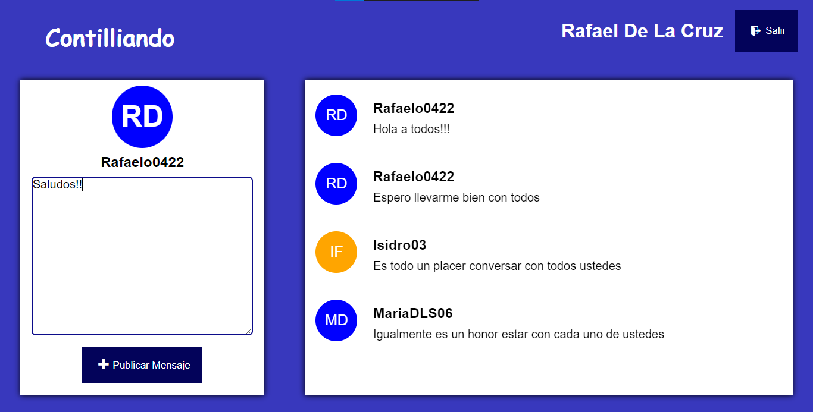

Esta es el proyecto final de Rafael Isidro De La Cruz Feliz (2021-0221), esta es la captura de pantalla:

Para acceder a la configuración de firebase, cree un archivo de tipo .env en el directorio raiz de proyecto y asigne las variables de entorno encontradas en el archivo:

